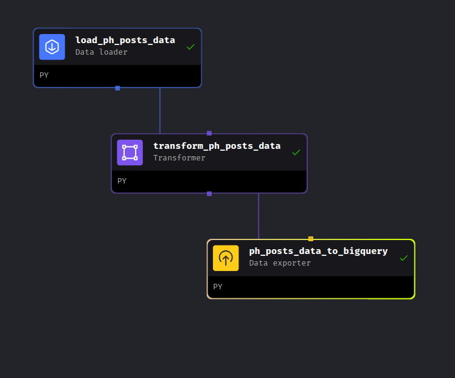
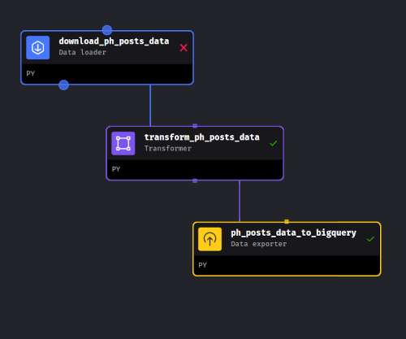
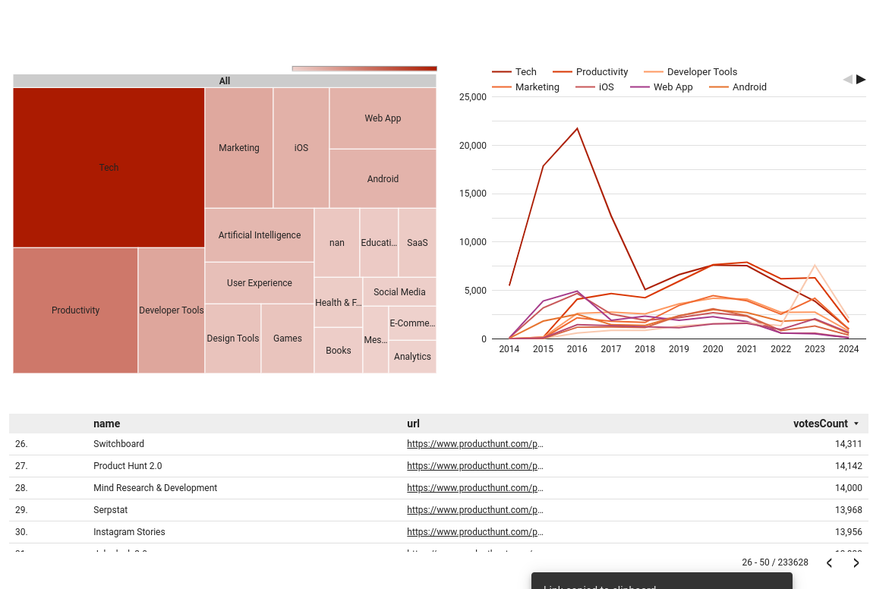
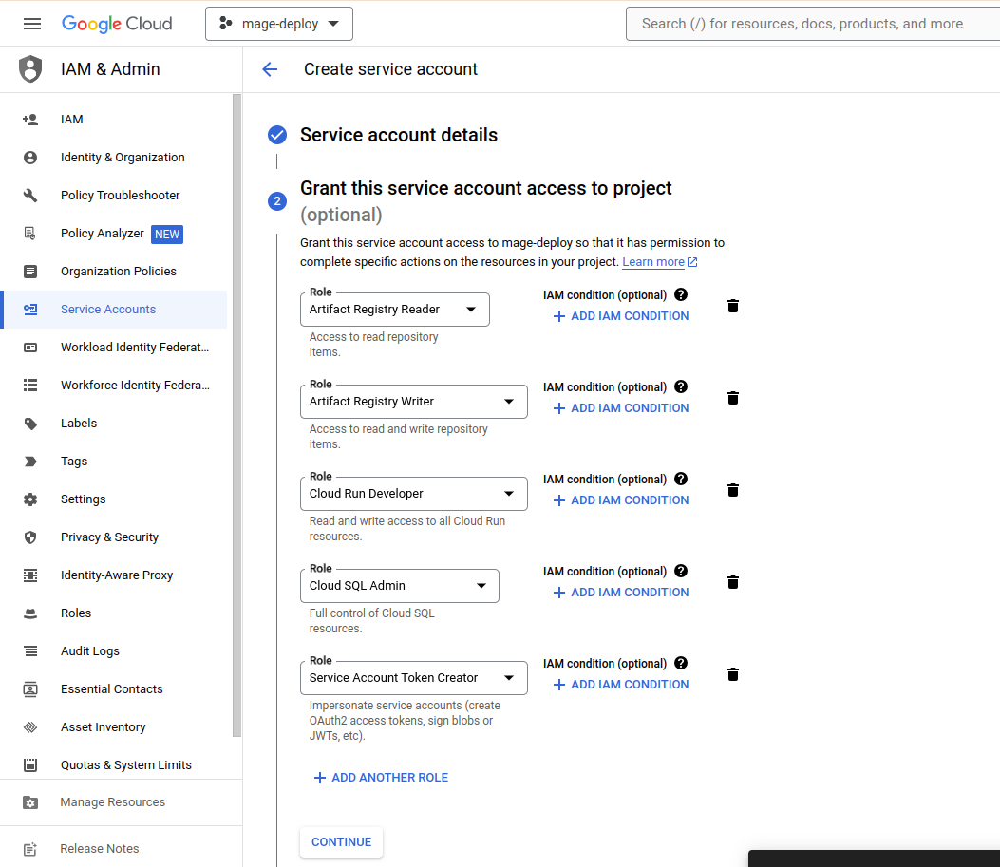

# Product Hunt Analysis - Data Engineering Capstone Project

_This is my final DE project for the [Data Engineering Zoomcamp 2024](https://github.com/DataTalksClub/data-engineering-zoomcamp) by [DataTalks.Club](https://datatalks.club/)_

## Objective
Developing an end-to-end pipeline to perform advanced analytics, to handle the ingestion, processing and data analysis, with the purpose of generating useful dashboard with daily data updates from the most popular startups launch website producthunt.com.

## Problem statement
Analysis information about last launched startups, most popular topics, correlation launches date and their activities on platform. This data needs to be automatically stored and processed in a way that analysts can quickly analyze and build out reports and dashboards.

## Dataset
I parsed previous data from archives using producthunt API: https://www.producthunt.com/leaderboard/daily/2024/4/16?ref=header_nav.

Producthunt API: ttps://api.producthunt.com/v2/docs

Downloaded data between 2014-01-01 and 2024-04-14 is stored here: https://github.com/kirill505/de-zoomcamp-project/releases/tag/posts


## Technologies
- Infrastructure as code (IaC): Terraform 
- Workflow orchestration: Mage
- Data Lake: Google Cloud Storage (GCS)
- DWH: BigQuery 
- Transformations: dbt 
- Dashboard: Google Data Studio / Looker Studio

## Data pipeline


### Pipeline 1
- The 1st pipeline downloading previous historical data from 2014 to 2024. These data I downloaded using producthunt API on my local machine.
- Then I uploaded these data to GCP using CLI tool gsutil. 
- And also this pipeline doing some data transformation: explicit casting of data types, data normalization.
- And finally I upload data, bunch of json files to GCP.



### Pipeline 2
- The 2nd pipeline running everyday and making API request for downloading data for previous day. I also use there producthunt API.
- And also this pipeline doing some data transformation: explicit casting of data types, data normalization.
- And finally I upload data for previous day to BigQuery.



## Dashboard
https://lookerstudio.google.com/reporting/b8205408-d9c1-45bf-a45d-14bcfa77f793


## Instructions on how to replicate the project

### 1. Setting up Google Cloud Platform account
In this section, I'll cover deploying Mage using Terraform and Google Cloud.
#### 1.2 Install and Setting up Terraform
Ensure that your system is up to date and you have installed the gnupg, software-properties-common, and curl packages installed. You will use these packages to verify HashiCorp's GPG signature and install HashiCorp's Debian package repository.
```bash
sudo apt-get update && sudo apt-get install -y gnupg software-properties-common
```

Install the HashiCorp GPG key.
```bash
wget -O- https://apt.releases.hashicorp.com/gpg | \
gpg --dearmor | \
sudo tee /usr/share/keyrings/hashicorp-archive-keyring.gpg
```

Verify the key's fingerprint.
```bash
gpg --no-default-keyring \
--keyring /usr/share/keyrings/hashicorp-archive-keyring.gpg \
--fingerprint
```

Add the official HashiCorp repository to your system. The lsb_release -cs command finds the distribution release codename for your current system, such as buster, groovy, or sid.
```bash
echo "deb [signed-by=/usr/share/keyrings/hashicorp-archive-keyring.gpg] \
https://apt.releases.hashicorp.com $(lsb_release -cs) main" | \
sudo tee /etc/apt/sources.list.d/hashicorp.list
```

Download the package information from HashiCorp.
```bash
sudo apt update
```

Install Terraform from the new repository.
```bash
sudo apt-get install terraform
```

Verify that the installation worked by opening a new terminal session and listing Terraform's available subcommands.
```bash
terraform -help
```

#### 1.2 Install and Setting up the gcloud CLI
Import the Google Cloud public key.
```bash
curl https://packages.cloud.google.com/apt/doc/apt-key.gpg | sudo gpg --dearmor -o /usr/share/keyrings/cloud.google.gpg
```

Add the gcloud CLI distribution URI as a package source.
```bash
echo "deb [signed-by=/usr/share/keyrings/cloud.google.gpg] https://packages.cloud.google.com/apt cloud-sdk main" | sudo tee -a /etc/apt/sources.list.d/google-cloud-sdk.list
```

Update and install the gcloud CLI:
```bash
sudo apt-get update && sudo apt-get install google-cloud-cli
```

Run gcloud init to get started
```bash
gcloud init
```
#### 1.3 Setup permissions for Service Account:



Preparing Google Cloud:
- Set `GOOGLE_APPLICATION_CREDENTIALS` to point to the file

```bash
export GOOGLE_APPLICATION_CREDENTIALS=~/.gc/cred_names.json
```

- Now authenticate:

```bash
gcloud auth activate-service-account --key-file $GOOGLE_APPLICATION_CREDENTIALS
```

#### 1.4 Setting up terraform and creating Secret 

Before running any Terraform commands, change the default value of the variable named project_id in the ./terraform/variables.tf file.

```yaml
variable "project_id" {
  type        = string
  description = "The name of the project"
  default     = "unique-gcp-project-id"
}
```

Creating secrets:

1. Go to Google Secret Manager UI.
2. Click the button at the top labeled + CREATE SECRET.
3. Fill in the name of your secret; e.g. bigquery_credentials.
4. Under Secret value, upload your service account credentials JSON file or paste the JSON into the text area labeled Secret value.
5. Scroll all the way down and click the button CREATE SECRET.

Mount secrets from Google Secret Manager through the Google Console UI.

1. Once you save a secret in Google Secret Manager, click on the PERMISSIONS tab.
2. Click the button + GRANT ACCESS.
3. Under the field labeled New principles, add the service account that is associated to your Google Cloud Run
4. Under the field labeled Select a role, enter the value Secret Manager Secret Accessor.
5. Click the button SAVE.

#### 1.5 Deploying:

1. Change directory into scripts folder:

```bash
cd terraform
```

2. Initialize Terraform:

```bash
terraform init
```

A sample output could look like this:
```bash
Initializing the backend...

Initializing provider plugins...
- Finding hashicorp/google versions matching ">= 3.3.0"...
- Finding latest version of hashicorp/http...
- Installing hashicorp/google v4.38.0...
- Installed hashicorp/google v4.38.0 (signed by HashiCorp)
- Installing hashicorp/http v3.1.0...
- Installed hashicorp/http v3.1.0 (signed by HashiCorp)

Terraform has created a lock file .terraform.lock.hcl to record the provider
selections it made above. Include this file in your version control repository
so that Terraform can guarantee to make the same selections by default when
you run "terraform init" in the future.

Terraform has been successfully initialized!

You may now begin working with Terraform. Try running "terraform plan" to see
any changes that are required for your infrastructure. All Terraform commands
should now work.

If you ever set or change modules or backend configuration for Terraform,
rerun this command to reinitialize your working directory. If you forget, other
commands will detect it and remind you to do so if necessary.
```

3. Deploy:

```bash
terraform apply
```

A sample output could look like this:

```bash
Apply complete! Resources: 7 added, 1 changed, 0 destroyed.

```

After a few minutes, open a browser the link you recieved above
