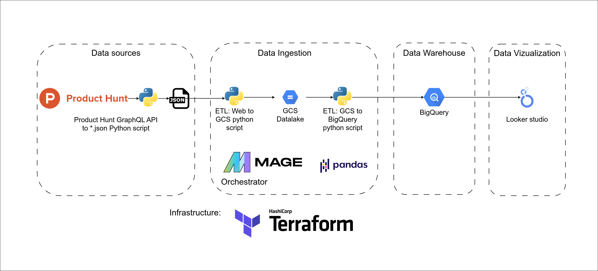
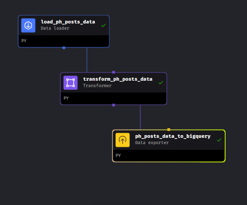

# ProductHunt Insights: End-to-End Data Engineering Capstone Project
***



This project, developed for the [Data Engineering Zoomcamp 2024](https://github.com/DataTalksClub/data-engineering-zoomcamp) by [DataTalks.Club](https://datatalks.club/), involves building an end-to-end data pipeline to extract, transform, and visualize ProductHunt data. The goal is to enable advanced analytics on startup launches, providing insights on trends, competitors, and optimal launch times. The pipeline includes data ingestion from the ProductHunt API, storage in Google Cloud Storage, processing with BigQuery, transformations via dbt, and visualization using Looker Studio.

***
## Technologies Used
- **Infrastructure as Code (IaC):** Terraform
- **Workflow Orchestration:** Mage
- **Data Lake:** Google Cloud Storage (GCS)
- **Data Warehouse (DWH):** BigQuery
- **Transformations:** Pandas
- **Dashboard:** Google Data Studio / Looker Studio

***
## Data Pipeline Overview
### Pipeline 1
1. **Data Extraction:** Download historical data (2014-2024) using the ProductHunt API.
2. **Transformation:** Cast data types and normalize data.
3. **Loading:** Upload transformed data to BigQuery.



### Pipeline 2
1. **Daily Updates:** Fetch previous day's data from ProductHunt API.
2. **Transformation:** Process and normalize data.
3. **Loading:** Append daily data to BigQuery.


***
## Dashboard
- Visualizes yearly and daily data.
- Analyzes best times and days for launching startups.
- Provides insights into popular topics and trends.

[Check out dashboard here](https://lookerstudio.google.com/reporting/b8205408-d9c1-45bf-a45d-14bcfa77f793)


## Instructions to Replicate the Project

1. [**Preparing data**](#0-preparing-dataset) Download historical data, updload to GCS bucket
2. [**Install Terraform:**](#1-install-and-setting-up-terraform) Setup Terraform for infrastructure management.
3. [**Install gcloud CLI:**](#2-install-and-setting-up-the-gcloud-cli) Configure Google Cloud CLI for managing services.
4. [**Setup Service Account:**](#3-setup-permissions-for-service-account-) Create and configure service accounts and permissions.
5. [**Creating Secrets**](#4-setting-up-terraform-and-creating-secret) Creating Secret
6. [**Deploy Infrastructure:**](#5-deploying-) Use Terraform scripts to deploy resources.

### 1. Preparing dataset
I parsed previous data from archives using producthunt API: https://api.producthunt.com/v2/docs

For parsing data I wrote the srcipt - producthunt_parser.py. It running by CMD. Example:
```bash
export PH_API_KEY='api_key'
python producthunt.py -d "2024-04-18 2024-04-17" -k "PH_API_KEY_2"
````

And downloaded historical data between 2014-01-01 and 2024-04-17 I uploaded to github: https://github.com/kirill505/de-zoomcamp-project/releases/tag/posts


But for next working with that data I uploaded to GCP using cmd tool - gsutil:
```bash
gsutil -m cp -r 2015 2016 2017 2018 2019 2020 2021 2022 2023 2024  gs://bucket_name
```


### Setting up Google Cloud Platform account
In this section, I'll cover deploying Mage using Terraform and Google Cloud.
#### 2. Install and Setting up Terraform
Ensure that your system is up to date and you have installed the gnupg, software-properties-common, and curl packages installed. You will use these packages to verify HashiCorp's GPG signature and install HashiCorp's Debian package repository.
```bash
sudo apt-get update && sudo apt-get install -y gnupg software-properties-common
```

Install the HashiCorp GPG key.
```bash
wget -O- https://apt.releases.hashicorp.com/gpg | \
gpg --dearmor | \
sudo tee /usr/share/keyrings/hashicorp-archive-keyring.gpg
```

Verify the key's fingerprint.
```bash
gpg --no-default-keyring \
--keyring /usr/share/keyrings/hashicorp-archive-keyring.gpg \
--fingerprint
```

Add the official HashiCorp repository to your system. The lsb_release -cs command finds the distribution release codename for your current system, such as buster, groovy, or sid.
```bash
echo "deb [signed-by=/usr/share/keyrings/hashicorp-archive-keyring.gpg] \
https://apt.releases.hashicorp.com $(lsb_release -cs) main" | \
sudo tee /etc/apt/sources.list.d/hashicorp.list
```

Download the package information from HashiCorp.
```bash
sudo apt update
```

Install Terraform from the new repository.
```bash
sudo apt-get install terraform
```

Verify that the installation worked by opening a new terminal session and listing Terraform's available subcommands.
```bash
terraform -help
```

#### 3. Install and Setting up the gcloud CLI
Import the Google Cloud public key.
```bash
curl https://packages.cloud.google.com/apt/doc/apt-key.gpg | sudo gpg --dearmor -o /usr/share/keyrings/cloud.google.gpg
```

Add the gcloud CLI distribution URI as a package source.
```bash
echo "deb [signed-by=/usr/share/keyrings/cloud.google.gpg] https://packages.cloud.google.com/apt cloud-sdk main" | sudo tee -a /etc/apt/sources.list.d/google-cloud-sdk.list
```

Update and install the gcloud CLI:
```bash
sudo apt-get update && sudo apt-get install google-cloud-cli
```

Run gcloud init to get started
```bash
gcloud init
```
#### 4. Setup permissions for Service Account:


Preparing Google Cloud:
- Set `GOOGLE_APPLICATION_CREDENTIALS` to point to the file

```bash
export GOOGLE_APPLICATION_CREDENTIALS=~/.gc/cred_names.json
```

- Now authenticate:

```bash
gcloud auth activate-service-account --key-file $GOOGLE_APPLICATION_CREDENTIALS
```

#### 5. Setting up terraform and creating Secret 

Before running any Terraform commands, change the default value of the variable named project_id in the ./terraform/variables.tf file.

```yaml
variable "project_id" {
  type        = string
  description = "The name of the project"
  default     = "unique-gcp-project-id"
}
```

Creating secrets:

1. Go to Google Secret Manager UI.
2. Click the button at the top labeled + CREATE SECRET.
3. Fill in the name of your secret; e.g. bigquery_credentials.
4. Under Secret value, upload your service account credentials JSON file or paste the JSON into the text area labeled Secret value.
5. Scroll all the way down and click the button CREATE SECRET.

Mount secrets from Google Secret Manager through the Google Console UI.

1. Once you save a secret in Google Secret Manager, click on the PERMISSIONS tab.
2. Click the button + GRANT ACCESS.
3. Under the field labeled New principles, add the service account that is associated to your Google Cloud Run
4. Under the field labeled Select a role, enter the value Secret Manager Secret Accessor.
5. Click the button SAVE.

#### 6. Deploying:

Change directory into scripts folder:

```bash
cd terraform
```

Initialize Terraform:

```bash
terraform init
```

A sample output could look like this:
```bash
Initializing the backend...

Initializing provider plugins...
- Finding hashicorp/google versions matching ">= 3.3.0"...
- Finding latest version of hashicorp/http...
- Installing hashicorp/google v4.38.0...
- Installed hashicorp/google v4.38.0 (signed by HashiCorp)
- Installing hashicorp/http v3.1.0...
- Installed hashicorp/http v3.1.0 (signed by HashiCorp)

Terraform has created a lock file .terraform.lock.hcl to record the provider
selections it made above. Include this file in your version control repository
so that Terraform can guarantee to make the same selections by default when
you run "terraform init" in the future.

Terraform has been successfully initialized!

You may now begin working with Terraform. Try running "terraform plan" to see
any changes that are required for your infrastructure. All Terraform commands
should now work.

If you ever set or change modules or backend configuration for Terraform,
rerun this command to reinitialize your working directory. If you forget, other
commands will detect it and remind you to do so if necessary.
```

Deploy:

```bash
terraform apply
```

A sample output could look like this:

```bash
Apply complete! Resources: 7 added, 1 changed, 0 destroyed.

```

After a few minutes, open a browser the link you recieved above
